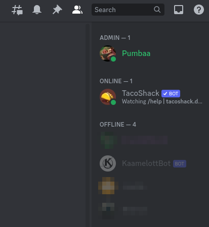

KAAMELOT DISCORD BOT
===

Summarry
---

TL;DR :

- [What is it](#what-is-it)
- [Installing the Bot on your Discord channel](#install-bot-discord)

For the developers :

- [How does it work](#how-it-works)
- [Hosting your own Server](#own-server)
- - [Creating and configuring the Bot](#setup-bot)
- - [Installing the Server with Docker](#own-server-with-docker)
- - [Installing the Server _Alamano©_](#own-server-alamano)
- - [Launching the Server](#launching-server)
- [Changelog](#changlog)
- [TODO](#todo)

<a name="what-is-it">What is it</a>
---
My friends and I are huge fans of the french TV Series [**Kaamelott**](https://fr.wikipedia.org/wiki/Kaamelott) and we can't stop ourselves to quote infamous inside joke about/from the show.
So when I stumbled upon [a repository](https://github.com/2ec0b4/kaamelott-soundboard) listing a bunch of quotes in small audio format I couldn't resist the urge to use it.
A huge Thanks to **2ec0b** and his dedication to build a well organized soundbox.

**KaamelottBot** is a silly bot who plays quotes in your current Discord voice-channel when you invoke it in any text-channel with `/kaamelott-audio (+option)`
It also can play animated gifs with `/kaamelott-gifs (+option)` 

i.e : 
```
/kaamelott-audio [Text:] révolte
# Bon ben révolte ! TUUUUUUUUT !!
```


<a name="install-bot-discord">Installing the Bot on your Discord channel</a>
---
Open [https://discord.com](discord.com) on your browser and login to your account.

Browse [this url](https://discord.com/api/oauth2/authorize?client_id=610852695128932362&permissions=277028653120&scope=bot%20applications.commands) (replace the `client_id` with yours if you run your own server)
```
https://discord.com/api/oauth2/authorize?client_id=610852695128932362&permissions=277028653120&scope=bot%20applications.commands
```

Add the bot to your Discord Server and grant the permission.


Now open your Discord application and you should see the the user **KaamelottBot** connected.



By default it can watch every Text Channel for some commands and play sounds in any Audio Channel. You can restrict this behavior in your Discord Settings.

Go to Integration, KaamelottBot, remove `# All Channels` and add the authorized Channels manually.


Go in any Audio Channel (or the ones you granted permission for) and type the first letters of `/kaamelott-audio`.


Select the command with [Enter] or with the mouse, type [Enter] again and you'll get a small audio clip played by the user **KaamelottBot**.


You can also search for a quote in particular if you select some Options with the `/kaamelott-audio`.
Select the command the same way above, but now select an option like `Titre` and type a title to look for. Or `Tout` to look in Titles, Characters or full quotes.

__That's all, folks !__ The rest of the giberish in this document is for programers and curious people.


<a name="how-it-works">How does it work</a>
---
**MP3**
When triggered with `/kaamelott-audio` the bot will use the following words to search for an audio file who's name contains it.

The files comes from [kaamelott-soundboard GitHub](https://github.com/2ec0b4/kaamelott-soundboard/tree/master/sounds) (a copy exists on [my github](https://github.com/pumbaa666/KaamelottBot/tree/master/sounds))

The file names and the full quotes are listed in [a JSON file](https://github.com/2ec0b4/kaamelott-soundboard/blob/master/sounds/sounds.json) (again, copy on [my github](https://github.com/pumbaa666/KaamelottBot/tree/master/sounds/sounds.json))

It take a random quote from the result, cache the audio locally and play the sound in the Discord voice-channel you're connected too.

The cached files are stored under `KaamelottBot/sounds/`

You need write privileges on this folder (at least `755`) `chmod -R 755 ./sounds/ ./gifs/`.

**Gifs**
Same goes for animated Gifs with the command `/kaamelott-gifs`.

The project as been forked from [kaamelott-gifboard](https://github.com/kaamelott-gifboard/kaamelott-gifboard) on GitHub.
A huge thanks to them too !


<a name="own-server">Hosting your own Server</a>
---
You can host the server on your own machine and not depends on Pumbaa.

Server Requirements
---
- node 19, nvm
- ffmpeg


<a name="setup-bot">Creating and configuring the Bot</a>
---
First you'll need to create the bot in your Developper panel on discord and set its rights.
Open https://discord.com on your browser and login to your account

Create a new Application on your [Developper panel](https://discord.com/developers/applications).


**General Information**

Note the `application id`, it's your `client_id` (they are replicated in tab `OAuth2/General`).


**Bot**

Generate the `token` and save it to `KaamelottBot/bin/conf/auth-prod.json` (duplicate it from `auth-dev.json`)
```
{
    "client_id": "YOUR-CLIENT-ID",
    "token": "YOUR-APPLICATION-TOKEN"
}
```

Enable `Presence intent`, `Server members intent`, `Message content intent`.

**OAuth2, General**

*Authorization method* : In-app Authorization

*Scope* : bot, applications.commands

*Bot permissions* : 277028653120

[Text] Send Messages, Send Messages in Threads, Embed Links, Attach Files, Read Message History, Add Reactions, Use Slash Commands

[Voice] Connect, Speak


<a name="own-server-with-docker">Installing the Server with Docker</a>
---

**Install Docker**
```
sudo install -m 0755 -d /etc/apt/keyrings
curl -fsSL https://download.docker.com/linux/debian/gpg | sudo gpg --dearmor -o /etc/apt/keyrings/docker.gpg
sudo chmod a+r /etc/apt/keyrings/docker.gpg
echo \
  "deb [arch="$(dpkg --print-architecture)" signed-by=/etc/apt/keyrings/docker.gpg] https://download.docker.com/linux/debian \
  "$(. /etc/os-release && echo "$VERSION_CODENAME")" stable" | \
  sudo tee /etc/apt/sources.list.d/docker.list > /dev/null
sudo apt-get update
sudo apt-get install docker-ce docker-ce-cli containerd.io docker-buildx-plugin docker-compose-plugin

sudo groupadd docker
sudo usermod -aG docker $USER
newgrp docker
docker run hello-world
```

**Install docker-compose**
```
DOCKER_CONFIG=${DOCKER_CONFIG:-$HOME/.docker}
mkdir -p $DOCKER_CONFIG/cli-plugins
curl -SL https://github.com/docker/compose/releases/download/v2.18.1/docker-compose-linux-x86_64 -o $DOCKER_CONFIG/cli-plugins/docker-compose

chmod +x $DOCKER_CONFIG/cli-plugins/docker-compose
PATH=$PATH:$DOCKER_CONFIG/cli-plugins/ # TODO persister
docker-compose version
```

**Build and run the application**
```
npm run docker-build
npm run docker-up
# or the native commands :
# docker build . -t pumbaa666/kaamelott_bot
# docker-compose up --detach --build
```

**Local files**

Installing the bot won't download any gifs or mp3, it's very light.

But they will be downloaded and cached on your local machine (in `gifs` and `sounds` folders) as the people uses it !

You can also pull them manually from their original repositories if you want some initial cache.
Your local `gifs` and `sounds` folders will be shared with the container.

Beware, the [Gifboard](https://github.com/kaamelott-gifboard/kaamelott-gifboard) contains above 1 GB of gifs !

The [Soundboard](https://github.com/2ec0b4/kaamelott-soundboard) is way lighter, around 50 MB.

**Administrator commands**

I put some admin commands only the user with the Discord Role `Admin` can use.

`kaamelott-refresh` : Force the refresh of the sounds/gifs list by parsing JSON from github

`kaamelott-clear` : Clear local cached audio/gifs files. Keep the *.json files.

<a name="own-server-alamano">Installing the Server _Alamano©_</a>
---
**KaamelottBot**

You will find the source here : https://github.com/pumbaa666/KaamelottBot.git
```
git clone https://github.com/pumbaa666/KaamelottBot.git
cd KaamelottBot
npm install -g typescript
npm install --save-dev @discordjs/uws@^10.149.0 # Or npm install -g npm-install-peers
npm install
tsc # to compile TypeScript to JavaScript in the bin folder
cp conf/auth-dev.json bin/conf/auth-prod.json
```
(See bellow for `auth-prod.json` content)

**Node** (with NVM, Node Version Manager)

```
curl -o- https://raw.githubusercontent.com/nvm-sh/nvm/v0.39.3/install.sh | bash
export NVM_DIR="$HOME/.nvm"
[ -s "$NVM_DIR/nvm.sh" ] && \. "$NVM_DIR/nvm.sh"  # This loads nvm
[ -s "$NVM_DIR/bash_completion" ] && \. "$NVM_DIR/bash_completion"  # This loads nvm bash_completion
nvm --version
# 0.39.3

nvm install 19
node --version
# v19.7.0
```

**FF-MPEG** 

```
apt -y install ffmpeg
ffmpeg -version
# ffmpeg version 4.4.2-0ubuntu0.22.04.1 Copyright (c) 2000-2021 the FFmpeg developers
built with gcc 11 (Ubuntu 11.2.0-19ubuntu1)
```

<a name="launching-server">Launching the Server</a>
---

**Dockerized**
First time only : `docker-compose build` (or `npm run docker-up`)

and then : `docker run --name kaamelott_bot --detach pumbaa666/kaamelott_bot` (or `npm run docker-run`)


**Alamano©**
First time only : `npm install`

and then : `node ./bin/src/bot.js` (or `npm run start`)


**As a service**
[Help](https://www.golinuxcloud.com/run-systemd-service-specific-user-group-linux/)

First time only :
```
which node # Note the absolute path of the node executable
pwd # Note the absolute path of the KaamelotBot directory
# You will use them in the following file :
sudo cp KaamelottBot/resources/kaamelott_bot.service /etc/systemd/system/kaamelott_bot.service
sudo vi /etc/systemd/system/kaamelott_bot.service
    # Put the values in ExecStart. Example :
    # ExecStart=/home/USER/.nvm/versions/node/v19.7.0/bin/node /home/USER/programmation/node/KaamelottBot/bin/src/bot.js

sudo systemctl daemon-reload # Required if you modified the .service file, not if you just created it.
```

and then : `sudo systemctl start kaamelott_bot.service`


<a name="changelog">Changelog</a>
---

- 2023.06.12 - Dockerization
Create a Docker version to run the app as a container instead of as a service.

- 2023.06.07 - Typescript
Translated Node.js to Typescript.

- 2023.x.y - v2
Major improvement, using Discord.js v2 regarding :
- - Command integration and call
- - Response design
- - Button to interact with (replay, pause)
- - Gifs !
- - Admin commands

- 2020.x.y - v1
First draft without the custom commands and options, Discord.js is not in v2 yet.

<a name="todo">TODO</a>
---

Here is the list of futur improvements. If this is empty it means the bot is perfect \o/

- implement fallback urls (kaamelot-soundboard, kaamelott-gifboard)
- add sounds from pending PR https://github.com/2ec0b4/kaamelott-soundboard/pulls
- list all the characters and propose them as option-value when looking for Characters. Same for titles ? Same for gifs.
- add a "please wait" (animated gif) when searching a media. Clean the response when showing the result (animated gif and message "Bougie")
- log the connection of the bot to API
